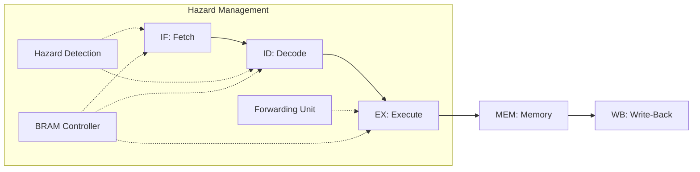

# 5-Stage Pipelined RISC-V Processor (RV32I Subset)

> This project implements a cycle-accurate, 5-stage pipelined RISC-V processor in Verilog. It is optimized for FPGA deployment with synchronous BRAM data memory and robust hazard handling.

## Key Features

- **5-stage Pipeline**: `IF` (Fetch) → `ID` (Decode) → `EX` (Execute) → `MEM` (Memory) → `WB` (Write-Back).
- **Synchronous BRAM Integration**: Data Memory (4KB) is inferred as Xilinx Block RAM for high-frequency performance.
- **BRAM Stall Logic**: Automatically manages the 1-cycle synchronous read latency by injecting a controlled 1-cycle stall during Memory operations.
- **Full Forwarding (Bypassing)**: Resolves RAW (Read-After-Write) hazards via EX-EX and MEM-EX bypassing, maintaining a CPI close to 1 for arithmetic code.
- **Hazard Detection Unit**: Supports interlocking for "Load-Use" dependencies, ensuring data integrity when a LOAD result is consumed immediately.
- **Branch Resolution**: Branches and jumps are resolved in the EX stage with pipeline flushing on taken/mispredicted paths.

## Instruction Set Support (RV32I)

| Type | Instructions |
|------|--------------|
| **R-type** | `ADD`, `SUB`, `SLL`, `SLT`, `SLTU`, `XOR`, `SRL`, `SRA`, `OR`, `AND` |
| **I-type** | `ADDI`, `SLTI`, `SLTIU`, `XORI`, `ORI`, `ANDI`, `SLLI`, `SRLI`, `SRAI`, `LW`, `LB`, `LH`, `LBU`, `LHU`, `JALR` |
| **S-type** | `SW`, `SB`, `SH` |
| **B-type** | `BEQ`, `BNE`, `BLT`, `BGE`, `BLTU`, `BGEU` |
| **U-type** | `LUI`, `AUIPC` |
| **J-type** | `JAL` |

## Hardware Synthesis Results

The project has been synthesized and implemented on the **Xilinx Kria K26 SOM** (Zynq UltraScale+).

### Resource Utilization
| Resource | Utilization |
|----------|-------------|
| **CLB LUTs** | 1115 |
| **CLB Registers** | 474 |
| **Block RAM (Tile)** | 1 |
| **CARRY8** | 28 |
| **F7 Muxes** | 1 |

### Timing & Power
- **Critical Path Delay**: ~8.32 ns.
- **Target Frequency (Fmax)**: ~120 MHz (Synthesized on Zynq UltraScale+ Kria K26).
- **Setup Slack (at 100 MHz)**: +2.176 ns (WNS, All timing constraints met).

## Verification

The processor is verified via a self-checking 4-phase testbench (`tb/tb_top.v`) that achieves **100% RV32I base ISA functional coverage**:

1. **Phase 1 — ISA Coverage** (14 checks): Tests every supported instruction bit-accurately.
2. **Phase 2 — Hazard Stress** (5 checks): Forces EX-EX/MEM-EX forwarding, Load-Use stalls, and BEQ taken/not-taken.
3. **Phase 3 — Integration** (1 check): Executes a "Sum 1 to 10" assembly loop.
4. **Phase 4 — Full RV32I** (25 checks): Covers `ANDI/ORI/XORI/SLTI/SLTIU`, `SLLI/SRLI/SRAI`, `SRA`, `AUIPC`, all 6 branch types (`BNE/BLT/BGE/BLTU/BGEU`), `JAL`, `JALR`, `LB/LH/LBU/LHU`, `SB/SH`.

**Result: 45/45 Checks PASSED.**

## Architecture Overview



### RTL File Structure

| File | Description |
|------|-------------|
| `top.v` | Structural top-level. Instantiates and connects all modules. No datapath logic. |
| `ex_stage.v` | **EX Stage module.** Encapsulates Forwarding MUXes, ALU, branch comparators, and jump target calculation. |
| `bram_ctrl.v` | **BRAM Stall Controller.** Manages the 1-cycle synchronous read latency of Block RAM. |
| `pc_reg.v` | Program Counter register with stall/redirect support. |
| `if_id_reg.v` | IF/ID pipeline register with stall and flush. |
| `id_ex_reg.v` | ID/EX pipeline register with stall and flush. |
| `ex_mem_reg.v` | EX/MEM pipeline register with stall. |
| `mem_wb_reg.v` | MEM/WB pipeline register with flush. |
| `control.v` | Main control unit (opcode → control signals). |
| `alu_control.v` | ALU operation decoder (alu_op + funct3/7 → alu_ctrl). |
| `alu.v` | 32-bit ALU supporting all RV32I arithmetic/logic ops. |
| `imm_gen.v` | Immediate generator for all RV32I instruction formats. |
| `regfile.v` | 32×32-bit register file with synchronous write, async read. |
| `imem.v` | Instruction Memory (ROM). |
| `dmem.v` | Data Memory (synchronous BRAM, 4KB). |
| `hazard.v` | Load-Use hazard detection unit. |
| `forward.v` | Data forwarding (bypass) unit. |


## How to Run

### Simulation (Vivado CLI)
```bash
# Run from project root
xvlog rtl/memory/imem.v rtl/memory/dmem.v rtl/memory/bram_ctrl.v \
       rtl/core/regfile.v rtl/core/control.v rtl/core/imm_gen.v \
       rtl/core/alu_control.v rtl/core/alu.v rtl/core/ex_stage.v \
       rtl/pipeline/if_id_reg.v rtl/pipeline/id_ex_reg.v \
       rtl/pipeline/ex_mem_reg.v rtl/pipeline/mem_wb_reg.v \
       rtl/core/hazard.v rtl/core/forward.v rtl/core/pc_reg.v \
       rtl/top/top.v tb/tb_top.v
xelab --snapshot tb_top_snap -top tb_top
xsim tb_top_snap --runall
```

### Synthesis
Open Vivado and add files in `rtl/`. Targeting Kria K26 or similar Zynq UltraScale+ boards is recommended for best BRAM utilization.
