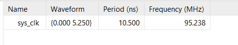
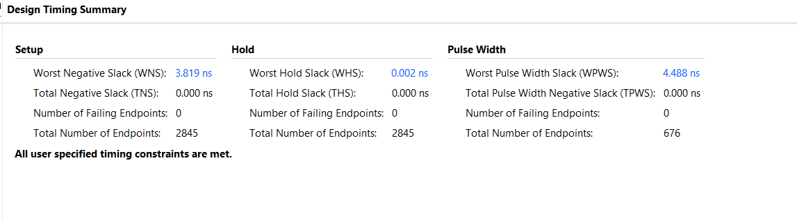
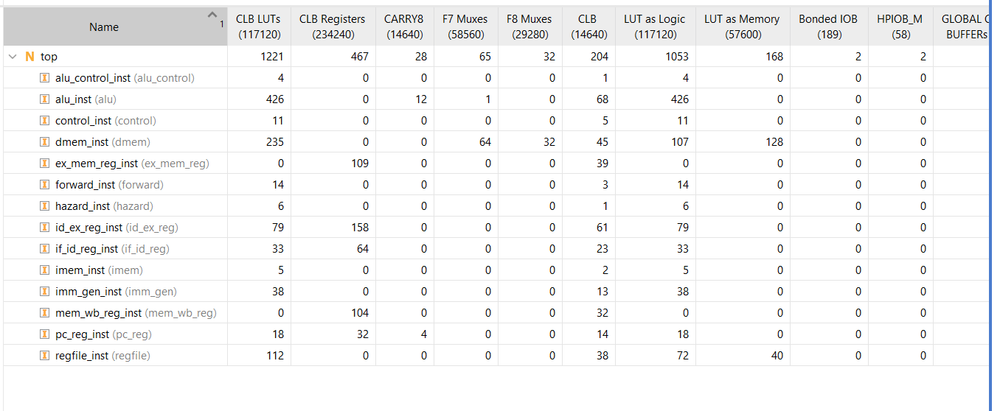
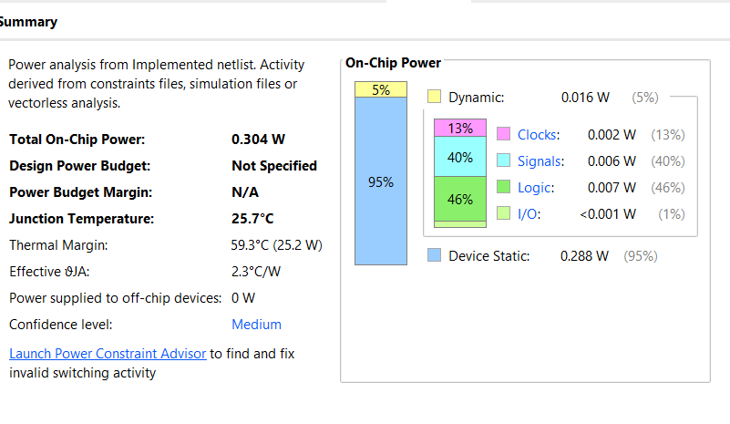

# 5-Stage Pipelined RISC-V Processor (RV32I Subset)

> This project was built to explore and review hardware design patterns related to SoCs. It demonstrates a deep understanding of how an instruction flows from Fetch to Decode, and how data hazards are resolved using Forwarding and Pipeline Stalls to reduce cycle penalties.

## Architecture Overview

This processor implements a comprehensive subset of the **RV32I Base Integer Instruction Set**:
- **Arithmetic & Logic**: `ADD`, `SUB`, `ADDI`, `AND`, `OR`, `XOR`, `SLL`, `SRL`, `SLT`, `SLTU`
- **Memory Access**: `LW`, `SW`
- **Control Flow**: `BEQ`, `BLT`, `JAL`
- **Immediate Loading**: `LUI`, `AUIPC`

Key architectural features include:
- **5-stage in-order pipeline:** `IF` (Fetch) → `ID` (Decode) → `EX` (Execute) → `MEM` (Memory) → `WB` (Write-Back).
- **Hazard Detection Unit:** Stalls the pipeline when a `Load-Use Data Hazard` is detected (when a dependent instruction immediately follows a Load). This freezes the PC and inserts a `NOP` bubble into the EX stage.
- **Forwarding Unit (Bypass):** Allows subsequent instructions to "borrow" the ALU result from the immediately preceding instruction (EX-EX forwarding) or an older instruction (MEM-EX forwarding) instead of waiting for it to be written to the register file. This entirely resolves 90% of RAW (Read-After-Write) hazards.
- **Branch Flush:** Resolves conditional branches at the `EX` stage, flushing the pipeline if mispredicted.

*Developed entirely in Verilog (RTL).*

## Hardware Synthesis & Implementation Results

The RTL design has been rigorously constrained, synthesized, and implemented using **Vivado** targeting the **Xilinx Kria K26 SOM** (Zynq UltraScale+). 

### 1. Timing Closure (Fmax ~150 MHz)
The pipeline operates cleanly with *Zero Setup/Hold violations*. With an applied target clock of **10.5 ns (~95.2 MHz)**, the post-implementation routing yields a massive Worst Negative Slack (WNS) of **+3.819 ns**, bringing the theoretical maximum frequency (Fmax) of the core to **~150 MHz**.



### 2. Resource & Power Efficiency
The core's physical footprint is highly optimized. Power tracking post-layout highlights phenomenal efficiency due to a balanced pipeline logic depth.
- **Resource Utilization**: ~1221 LUTs, 467 Registers
- **Power**: ~0.304 W (Dynamic + Static)



## Code Structure

```text
riscv_pipeline/
├── rtl/
│   ├── top.v               // Top Module, integrates DataPath, Forwarding, and Hazard Detection
│   ├── pc_reg.v            // Program Counter
│   ├── alu.v               // Arithmetic Logic Unit (Addition, Subtraction, Equality Check)
│   ├── control.v           // Instruction Decoder Unit
│   ├── hazard.v            // Hazard Unit for stalling
│   ├── forward.v           // Forwarding Unit MUXes
│   └── ... (pipeline registers: if_id_reg, id_ex_reg, ex_mem_reg, mem_wb_reg)
├── tb/
│   ├── tb_top.v            // Self-checking automated testbench
│   └── test_*.hex          // Executable hex files (ISA checks, Hazard checks)
└── sim_logs/               // Vivado simulation logs
```

## Running the Simulation

Simulation executes an automated 3-phase behavioral test covering:
1. **ISA Coverage Test**: Validates ALU logic, Load/Store address calculation, and branches.
2. **Hazard & Forwarding Tests**: Rigorously tests `EX-EX` forwarding, `MEM-EX` forwarding, and `Load-Use` branch stall injections.
3. **Integration Test**: Computes the sum from 1 to 10 in Assembly.

If using Vivado CLI from the `riscv_pipeline` directory:
```bash
mkdir sim_logs
cd sim_logs
xvlog -sv ../rtl/*.v ../tb/*.v
xelab --timescale 1ns/1ps -debug typical -top tb_top -snapshot tb_top_snapshot
xsim tb_top_snapshot -R
```


